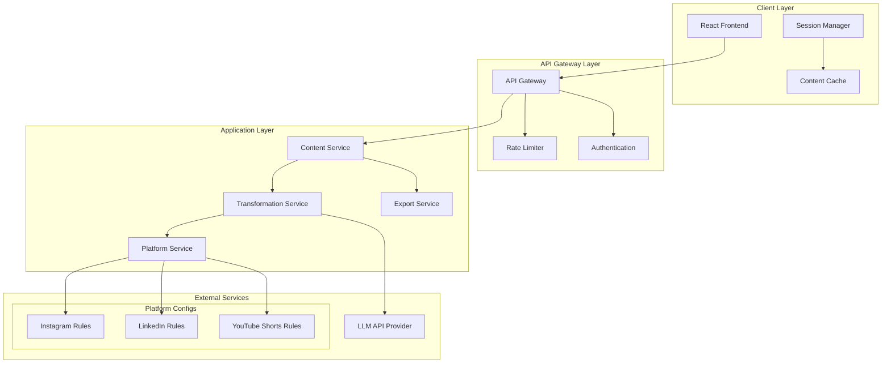

# Design Document

## Overview

AI ReContent is a web-based content repurposing platform that transforms single pieces of content into multiple platform-optimized formats. The system leverages pre-trained LLM APIs to automatically adapt content tone, length, and structure for Instagram, LinkedIn, and YouTube Shorts while maintaining the core message integrity.

The architecture follows a client-server model with a React-based frontend and Node.js backend, emphasizing simplicity, fast processing, and user experience optimization. The design prioritizes session-based data handling, robust error management, and seamless API integration patterns.

## Architecture

### High-Level Architecture



### Component Architecture

The system is organized into distinct layers with clear separation of concerns:

**Presentation Layer**: React-based SPA handling user interactions, content display, and session state management
**API Layer**: Express.js server providing RESTful endpoints with rate limiting and error handling
**Business Logic Layer**: Core services for content transformation, platform optimization, and export functionality
**Integration Layer**: LLM API clients with retry logic, fallback mechanisms, and response parsing

## Components and Interfaces

### Frontend Components

**ContentInputComponent**
- Manages text input with character counting and validation
- Provides real-time feedback on content length and format
- Handles paste operations and formatting preservation
- Interface: `{ content: string, onContentChange: (content: string) => void, maxLength: number }`

**PlatformSelectorComponent**
- Renders platform selection checkboxes with visual indicators
- Manages multi-platform selection state
- Provides platform-specific guidance and previews
- Interface: `{ selectedPlatforms: Platform[], onSelectionChange: (platforms: Platform[]) => void }`

**ContentPreviewComponent**
- Displays generated content in platform-specific layouts
- Shows character counts and optimization metrics
- Provides visual feedback for content that exceeds limits
- Interface: `{ generatedContent: PlatformContent[], onExport: (platform: Platform) => void }`

**ExportComponent**
- Handles copy-to-clipboard and download operations
- Manages export state and user feedback
- Provides batch export functionality for multiple platforms
- Interface: `{ content: PlatformContent[], onExportComplete: (success: boolean) => void }`

### Backend Services

**ContentTransformationService**
- Orchestrates the content transformation pipeline
- Manages LLM API calls with retry logic and error handling
- Implements platform-specific optimization rules
- Interface: `transformContent(input: ContentInput, platforms: Platform[]): Promise<TransformationResult>`

**PlatformOptimizationService**
- Applies platform-specific rules for tone, length, and format
- Manages character limits and content structure requirements
- Handles hashtag integration and call-to-action placement
- Interface: `optimizeForPlatform(content: string, platform: Platform): OptimizedContent`

**LLMIntegrationService**
- Manages API connections to OpenAI or alternative LLM providers
- Implements request queuing, rate limiting, and cost optimization
- Handles prompt engineering and response parsing
- Interface: `generateContent(prompt: string, parameters: LLMParameters): Promise<LLMResponse>`

**SessionManagementService**
- Manages user session data with browser storage integration
- Implements data persistence and cleanup policies
- Handles session recovery and state restoration
- Interface: `saveSession(sessionData: SessionData): void, restoreSession(): SessionData`

## Data Models

### Core Data Structures

```typescript
interface ContentInput {
  id: string;
  originalText: string;
  characterCount: number;
  createdAt: Date;
  sessionId: string;
}

interface Platform {
  id: 'instagram' | 'linkedin' | 'youtube-shorts';
  name: string;
  characterLimit: number;
  toneGuidelines: ToneProfile;
  formatRequirements: FormatRules;
}

interface ToneProfile {
  style: 'casual' | 'professional' | 'engaging';
  vocabulary: 'simple' | 'business' | 'creative';
  callToActionStyle: string;
  hashtagStrategy: 'minimal' | 'moderate' | 'extensive';
}

interface TransformationResult {
  inputId: string;
  platformResults: PlatformContent[];
  processingTime: number;
  apiCost: number;
  status: 'success' | 'partial' | 'failed';
}

interface PlatformContent {
  platform: Platform;
  optimizedText: string;
  characterCount: number;
  toneAdjustments: string[];
  lengthOptimization: 'shortened' | 'expanded' | 'maintained';
  qualityScore: number;
}

interface SessionData {
  sessionId: string;
  currentInput: ContentInput | null;
  lastResults: TransformationResult | null;
  selectedPlatforms: Platform[];
  preferences: UserPreferences;
  expiresAt: Date;
}
```

### Platform Configuration

Each platform maintains specific optimization rules:

**Instagram Configuration**:
- Character limit: 2,200 characters
- Tone: Casual, visual-focused, emoji-friendly
- Structure: Hook + story + call-to-action + hashtags
- Hashtag strategy: 5-10 relevant hashtags

**LinkedIn Configuration**:
- Character limit: 3,000 characters (optimal: 1,300-1,900)
- Tone: Professional, value-driven, industry-focused
- Structure: Professional hook + insights + professional CTA
- Hashtag strategy: 3-5 professional hashtags

**YouTube Shorts Configuration**:
- Character limit: 5,000 characters (script format)
- Tone: Engaging, hook-driven, action-oriented
- Structure: Strong hook + quick value + engagement CTA
- Format: Script with timing cues and engagement prompts

## Correctness Properties

*A property is a characteristic or behavior that should hold true across all valid executions of a system—essentially, a formal statement about what the system should do. Properties serve as the bridge between human-readable specifications and machine-verifiable correctness guarantees.*

Before defining the correctness properties, I need to analyze the acceptance criteria from the requirements to determine which are testable as properties.

### Content Input Properties

**Property 1: Input validation for valid content**
*For any* text input up to 10,000 characters, the Content_Input_System should accept and process the content successfully
**Validates: Requirements 1.2**

**Property 2: Input rejection for oversized content**
*For any* text input exceeding 10,000 characters, the Content_Input_System should reject the input and display a warning message
**Validates: Requirements 1.3**

**Property 3: Formatting preservation**
*For any* text input containing line breaks and basic formatting, the Content_Input_System should preserve the original formatting in the stored content
**Validates: Requirements 1.5**

### Platform Selection Properties

**Property 4: Multi-platform selection support**
*For any* combination of the three available platforms (Instagram, LinkedIn, YouTube Shorts), the Platform_Selection_System should allow simultaneous selection and maintain the selection state
**Validates: Requirements 2.2, 2.4**

**Property 5: Selection state updates**
*For any* change in platform selection, the Platform_Selection_System should immediately update the interface to reflect the new selection state
**Validates: Requirements 2.5**

### Content Transformation Properties

**Property 6: LLM API integration for all transformations**
*For any* valid content input and platform selection, the Content_Transformation_Engine should process the content using LLM_API integration
**Validates: Requirements 3.1**

**Property 7: Platform-specific optimization rules**
*For any* content input, when transformed for a specific platform, the Content_Transformation_Engine should apply the appropriate optimization rules (visual storytelling for Instagram, professional tone for LinkedIn, engagement optimization for YouTube Shorts)
**Validates: Requirements 3.2, 3.3, 3.4**

**Property 8: API failure retry mechanism**
*For any* API call failure, the Content_Transformation_Engine should retry up to 3 times before displaying an error message
**Validates: Requirements 3.5**

### Length and Tone Optimization Properties

**Property 9: Platform-specific length constraints**
*For any* generated content, the Length_Optimization_System should enforce platform-specific character limits (Instagram: ≤2,200, LinkedIn: 1,300-3,000 optimal, YouTube Shorts: script format)
**Validates: Requirements 4.1, 4.2, 4.3**

**Property 10: Platform-appropriate tone application**
*For any* content transformation, the Tone_Adjustment_System should apply platform-appropriate tone (casual for Instagram, professional for LinkedIn, engaging for YouTube Shorts)
**Validates: Requirements 4.5, 4.6, 4.7**

### Preview System Properties

**Property 11: Complete preview display**
*For any* successful content generation, the Preview_System should display all generated platform versions with their respective character counts
**Validates: Requirements 5.1, 5.2**

**Property 12: Limit violation warnings**
*For any* generated content that exceeds platform limits, the Preview_System should highlight the excess and provide appropriate warnings
**Validates: Requirements 5.3**

### Export System Properties

**Property 13: Export functionality availability**
*For any* generated content, the Export_System should provide both copy-to-clipboard and download functionality for each platform version
**Validates: Requirements 6.1, 6.3**

**Property 14: Export operation feedback**
*For any* export operation (copy or download), the Export_System should provide immediate user feedback and organize content with clear platform labels
**Validates: Requirements 6.2, 6.4**

**Property 15: Export error handling**
*For any* failed export operation, the Export_System should display appropriate error messages and provide retry options
**Validates: Requirements 6.5**

### Error Handling Properties

**Property 16: User-friendly error messaging**
*For any* system error (API failures, network issues, processing errors), the Error_Handling_System should display user-friendly messages without technical details and provide clear next steps
**Validates: Requirements 7.1, 7.2, 7.5**

**Property 17: Progress indication for long operations**
*For any* content processing operation that exceeds expected duration, the Error_Handling_System should display progress indicators
**Validates: Requirements 7.3**

**Property 18: Privacy-preserving error logging**
*For any* error that occurs, the Error_Handling_System should log debugging information while protecting user privacy
**Validates: Requirements 7.4**

### Session Management Properties

**Property 19: Session data persistence**
*For any* user input or generated content during a browser session, the Session_Management_System should preserve the data until the session ends
**Validates: Requirements 8.1, 8.2**

**Property 20: Session recovery after page refresh**
*For any* active session state, when a user refreshes the page, the Session_Management_System should restore the complete work state
**Validates: Requirements 8.3**

**Property 21: Data cleanup on session end**
*For any* user session, when the browser session ends or tab is closed, the Session_Management_System should clear all user data without permanent storage
**Validates: Requirements 8.4, 8.5**

## Error Handling

### Error Classification and Response Strategy

**API Integration Errors**:
- LLM API rate limiting: Implement exponential backoff with user notification
- API service unavailability: Provide fallback messaging and retry scheduling
- Authentication failures: Clear error messaging with guidance for resolution
- Malformed API responses: Graceful degradation with partial results when possible

**User Input Errors**:
- Invalid content format: Real-time validation with specific guidance
- Content length violations: Progressive warnings with character count feedback
- Empty or whitespace-only input: Immediate feedback with example suggestions
- Special character handling: Automatic sanitization with user notification

**System Errors**:
- Network connectivity issues: Offline detection with retry mechanisms
- Browser compatibility problems: Feature detection with graceful fallbacks
- Session storage failures: Alternative storage methods with user notification
- Export operation failures: Multiple export format options with error recovery

**Error Recovery Patterns**:
- Automatic retry with exponential backoff for transient failures
- User-initiated retry options for recoverable errors
- Graceful degradation for partial system failures
- Clear error boundaries to prevent cascade failures

### Error Monitoring and Logging

**Client-Side Error Tracking**:
- JavaScript error boundary implementation
- User action logging for error context
- Performance monitoring for timeout detection
- Privacy-compliant error reporting

**Server-Side Error Management**:
- Structured logging with correlation IDs
- API response time monitoring
- Rate limiting and abuse detection
- Health check endpoints for system monitoring

## Testing Strategy

### Dual Testing Approach

The testing strategy employs both unit testing and property-based testing to ensure comprehensive coverage:

**Unit Testing Focus**:
- Specific user interaction scenarios and edge cases
- API integration error conditions and retry logic
- Session management state transitions
- Export functionality with various content formats
- Platform-specific optimization rule validation

**Property-Based Testing Focus**:
- Universal properties that hold across all content inputs
- Platform optimization rules across diverse content types
- Input validation behavior across all possible input variations
- Session persistence across all possible user interaction patterns
- Error handling consistency across all failure scenarios

### Property-Based Testing Configuration

**Testing Framework**: Fast-check for JavaScript/TypeScript property-based testing
**Test Configuration**: Minimum 100 iterations per property test to ensure comprehensive input coverage
**Property Test Tagging**: Each property test tagged with format: **Feature: ai-recontent-platform, Property {number}: {property_text}**

**Example Property Test Structure**:
```typescript
// Feature: ai-recontent-platform, Property 1: Input validation for valid content
fc.assert(fc.property(
  fc.string({ minLength: 1, maxLength: 10000 }),
  (content) => {
    const result = ContentInputSystem.validateInput(content);
    return result.isValid === true;
  }
), { numRuns: 100 });
```

**Unit Test Complementarity**:
- Unit tests validate specific examples and integration points
- Property tests verify universal correctness across input space
- Together they provide both concrete validation and comprehensive coverage
- Unit tests catch specific bugs, property tests verify general correctness

### Integration Testing Strategy

**API Integration Testing**:
- Mock LLM API responses for consistent testing
- Test retry logic with simulated API failures
- Validate rate limiting and cost optimization
- Test response parsing and error handling

**End-to-End User Workflow Testing**:
- Complete user journeys from input to export
- Cross-browser compatibility validation
- Mobile responsiveness testing
- Accessibility compliance verification

**Performance Testing**:
- Content processing time validation
- Concurrent user load testing
- Memory usage monitoring during long sessions
- API response time measurement and optimization

## Security Considerations

### Data Privacy and Protection

**Session Data Handling**:
- All user content stored only in browser session storage
- No permanent server-side storage of user content
- Automatic data cleanup on session termination
- GDPR-compliant data handling practices

**API Security**:
- Secure API key management with environment variables
- Rate limiting to prevent abuse and cost overruns
- Request/response logging without sensitive data exposure
- HTTPS enforcement for all external communications

**Client-Side Security**:
- Content sanitization to prevent XSS attacks
- CSP headers to restrict resource loading
- Input validation on both client and server sides
- Secure session token management

### Authentication and Authorization

**API Access Control**:
- Server-side API key validation for LLM services
- Request origin validation to prevent unauthorized access
- Rate limiting per session to prevent abuse
- Cost monitoring and alerting for API usage

**User Session Security**:
- Secure session identifier generation
- Session timeout implementation for inactive users
- Browser storage encryption for sensitive session data
- Cross-site request forgery (CSRF) protection

## Non-Functional Design Considerations

### Performance Optimization

**Response Time Targets**:
- Content transformation: < 30 seconds for standard inputs
- UI interactions: < 200ms for immediate feedback
- Export operations: < 5 seconds for all formats
- Session recovery: < 2 seconds for state restoration

**Scalability Design**:
- Stateless server architecture for horizontal scaling
- Client-side caching for platform configuration data
- API request queuing for high-traffic periods
- CDN integration for static asset delivery

**Resource Optimization**:
- Lazy loading for non-critical UI components
- Efficient API call batching for multiple platforms
- Memory management for large content processing
- Browser storage optimization for session data

### Accessibility and Usability

**WCAG 2.1 AA Compliance**:
- Keyboard navigation support for all interactions
- Screen reader compatibility with semantic HTML
- High contrast mode support for visual elements
- Alternative text for all informational graphics

**Mobile Responsiveness**:
- Touch-friendly interface design for mobile devices
- Responsive layout adaptation for various screen sizes
- Optimized performance for mobile network conditions
- Progressive web app capabilities for offline access

**User Experience Optimization**:
- Progressive disclosure of advanced features
- Contextual help and guidance throughout the workflow
- Undo/redo functionality for content modifications
- Keyboard shortcuts for power users

## Design Constraints

### Technical Constraints

**Browser Compatibility Requirements**:
- Support for Chrome 90+, Firefox 88+, Safari 14+, Edge 90+
- JavaScript ES2020 feature compatibility
- CSS Grid and Flexbox layout support
- Web Storage API availability for session management

**API Integration Limitations**:
- OpenAI API rate limits and cost considerations
- Network dependency for all AI processing operations
- API response time variability affecting user experience
- Token limit constraints for large content inputs

**Development Timeline Constraints**:
- Hackathon development timeframe limiting feature scope
- No custom AI model training or fine-tuning
- Pre-built component library usage for rapid development
- Minimal backend infrastructure for quick deployment

### Business Constraints

**Cost Management**:
- API usage monitoring and cost optimization
- Rate limiting to prevent unexpected charges
- Efficient prompt engineering to minimize token usage
- Fallback options for API service interruptions

**Scope Limitations**:
- Text-only content processing (no multimedia support)
- Limited to three target platforms initially
- No real-time collaboration features
- No advanced analytics or performance tracking

**Compliance Requirements**:
- Data privacy regulations compliance (GDPR, CCPA)
- Platform terms of service adherence
- Accessibility standards compliance
- Security best practices implementation